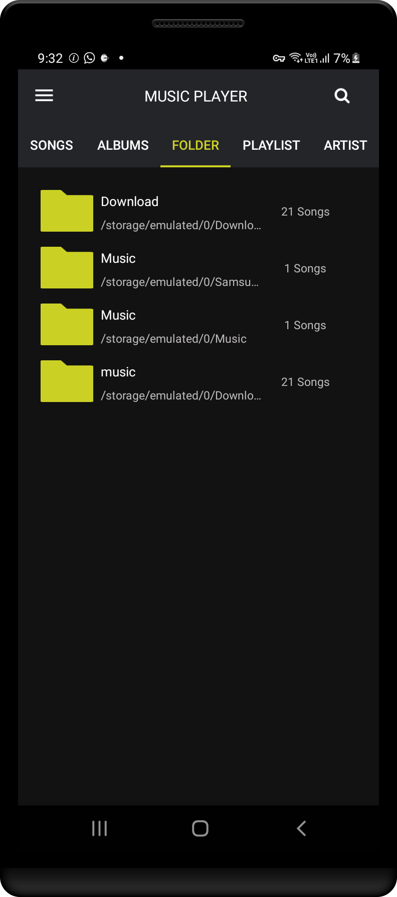
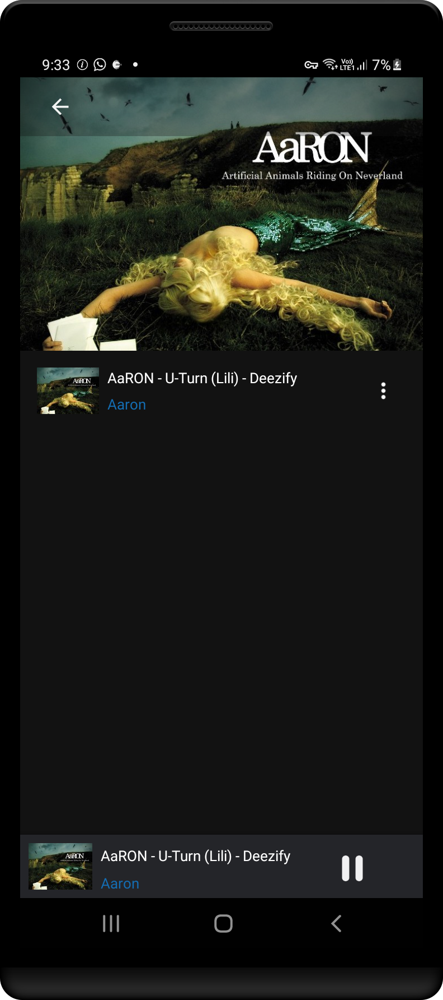
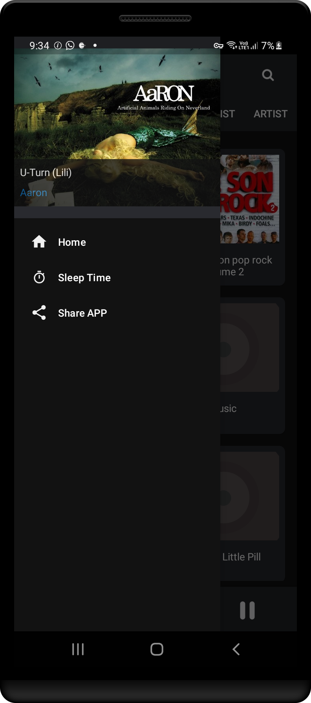

  <a href="https://retromusic.app">
    
    <h1 align="center">Dark Music Player</h1>
  </a>

  
  
  
  
  
  

## 📱 Screenshots

### Sample Player screen
| | | |  |
|:---:|:---:|:---:|:---:|
| Album | Folder | Music playing |Settings |
