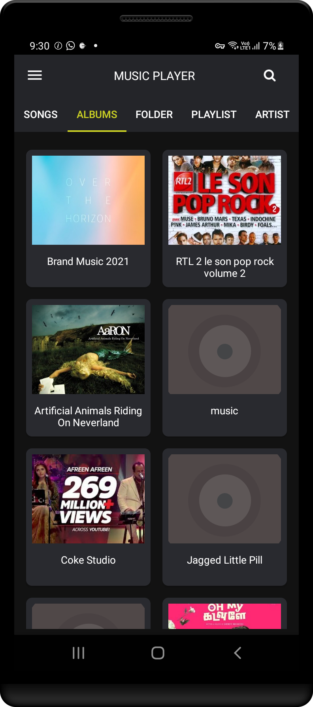

  <a href="https://retromusic.app">
    
    <h1 align="center">Dark Music Player</h1>
  </a>

  
  
  
  
  
  

## 📱 Screenshots

### Sample Player screen
| | | |  |
|:---:|:---:|:---:|:---:|
| Album | Folder | Music playing |Settings |

## 📦 Included Features

- Support all music and audio formats, like MP3, MIDI, WAV, FLAC, Music player, songs player, audio player, mp3 player with high quality.
- Browse all songs by album,artist,genres,folder
- Dark Theme
- Playlist
- Sleep Timer
- Favorite songs and custom your playlist in mp3 player.
- Playing notification

